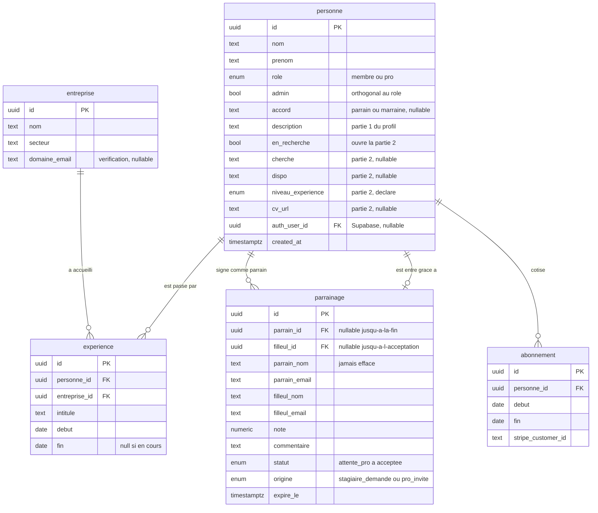
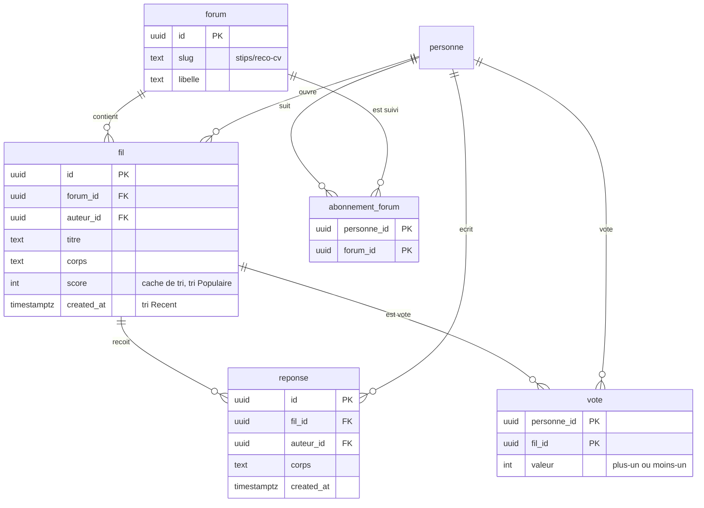
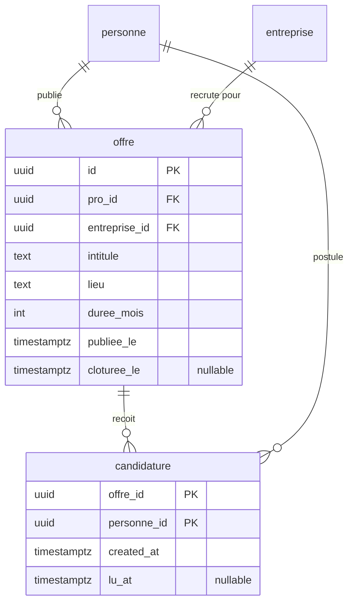
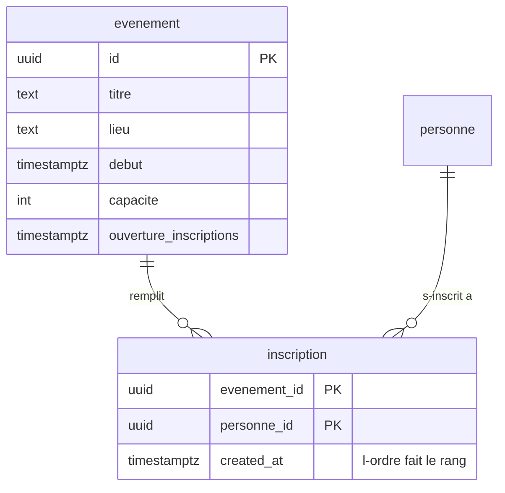
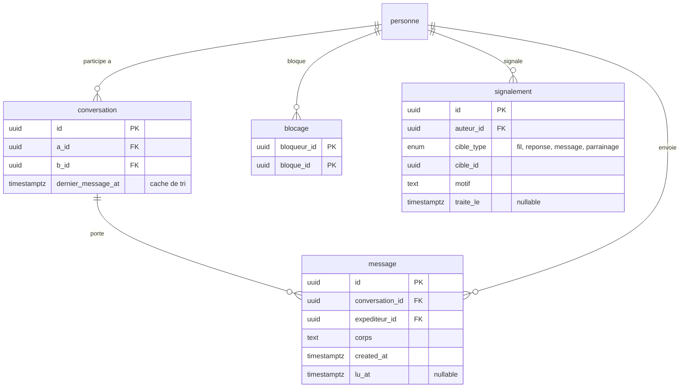

# Le schéma de Stips, en images

Le *pourquoi* de chaque choix est dans [`README.md`](./README.md) ; ce fichier est la carte.
Dix-huit tables, découpées en cinq domaines parce qu'un seul diagramme de dix-huit tables ne
se lit pas.

`personne` porte ses colonnes une seule fois, dans le premier diagramme. Elle réapparaît
ensuite sans son bloc d'attributs — c'est le même hub partout.

---

## 1. Identité, parrainage, cotisation

Le cœur. `parrainage` est l'objet qui fait exister un membre, et c'est la seule table qui
mélange clés étrangères et identités en texte : aux premières étapes du flux, ni le filleul ni
parfois le parrain n'ont de compte.

**Ce qui n'est pas là, et c'est voulu** : pas de colonne `sexe` (seul l'accord grammatical
servait), pas de table `carte` (la carte flip est une route, pas une entité), pas de colonne
`reponse_filleul` (le recours est un signalement).

---

## 2. Forum

Un vote est une **ligne**, pas un compteur : c'est la clé primaire `(personne_id, fil_id)` qui
interdit le double vote. `fil.score` est un cache de tri au-dessus de ces lignes, recalculable
par un `COUNT(*)`.

---

## 3. Recrutement

Une offre appartient à un pro **et** à une entreprise : le pro peut changer d'employeur, ses
anciennes offres ne suivent pas.

⚠️ `entreprise_id`, `lieu`, `duree_mois` et `cloturee_le` n'existent pas dans les données
factices d'aujourd'hui : `Offre` n'a qu'une chaîne `meta` et pas d'employeur du tout. Ça ne se
voyait pas tant que seul le pro regardait ses propres offres — l'écran Stages du membre l'a
révélé.

---

## 4. Événements

**Aucun compteur d'inscrits, et aucun verrou sur les places.** On insère tout le monde ; les
`capacite` premiers par `created_at` sont inscrits, les suivants sont en liste d'attente. Pas
de vérification-puis-insertion, donc pas de survente, et une annulation promeut le suivant
sans qu'on fasse rien.

---

## 5. Messagerie et modération

Tout le monde peut écrire à tout le monde, donc aucune table d'autorisation — et `blocage`
devient le seul frein du système. `conversation` existe pour rendre la liste des conversations
indexable sans normaliser la paire avec `LEAST`/`GREATEST` dans une sous-requête.

`signalement.cible_type = 'parrainage'` est le recours d'un membre sur sa propre reco. C'est
tout le dispositif de rectification : zéro table, zéro colonne en plus.

---

## Le journal des décisions

| Décision | Raison courte |
|---|---|
| Une table `personne`, pas `Member` + `Sponsor` | mêmes colonnes, et un membre devient pro ; deux tables imposeraient des clés étrangères nullables XOR partout |
| Deux rôles, `membre` et `pro` ; « parrain » déduit | être parrain est un rôle dans une relation, pas un type de compte |
| `admin` en booléen séparé | Papa est aussi un membre ou un pro ; un troisième rôle ne composerait pas |
| Pas de colonne `sexe` | le seul usage réel était l'accord grammatical — on stocke le terme voulu |
| Pas de table `carte` | la carte flip est une projection de trois tables : une route, pas une entité |
| Une note par `parrainage`, la globale calculée | un membre accumule des recos au fil de ses stages |
| Aucun compteur stocké… | `inscrits`, `votes`, `heures`, `duree`, `membresTotal` dérivent de lignes ou de dates |
| …sauf deux clés de tri | `fil.score` et `conversation.dernier_message_at` : un `COUNT()`/`MAX()` en sous-requête ne s'indexe pas |
| Un vote = une ligne | la clé primaire composite interdit le double vote, et permet de le retirer |
| Places par ordre d'arrivée | supprime la course sur la capacité au lieu de la verrouiller |
| Une table `forum`, pas une énumération | à 10 000 membres la liste bougera, et une valeur d'énum est une migration |
| `conversation` en plus de `message` | rend la liste des conversations indexable sans astuce `LEAST`/`GREATEST` |
| `blocage` et `signalement` | règle 1.2 d'Apple sur le contenu généré : condition de mise en ligne, pas prévision |
| Tout le monde peut écrire à tout le monde | tranché produit — le blocage et une limite de débit deviennent le seul frein |
| Un seul `parrainage`, deux `origine` | les deux chemins d'entrée produisent le même objet |
| Pas de validation si le pro a un compte | il est déjà vérifié ; la charge passe à un plafond d'invitations |
| `parrain_nom` jamais effacé | un membre doit pouvoir dire qui l'a parrainé même si ce pro n'a pas de compte |
| Recours sur une reco = signalement | « la reco est forcément bonne » ne couvre ni l'art. 16 ni l'art. 14 ; le signalement les couvre pour zéro colonne |
| `niveau_experience` déclaré | tranché produit, contre recommandation : peut contredire les `experience` affichées en dessous |
| Des UUID, pas des entiers | des identifiants énumérables laissent parcourir l'annuaire d'un club privé |
| Notre API devant Postgres | le contrat additif et `/v1` supposent une couche qu'on contrôle ; en mode client-direct le schéma *est* l'API publique |

---

## Faire une plus belle version de ce schéma

Les diagrammes ci-dessus sont en Mermaid : ils vivent dans le repo, se versionnent avec le
schéma, se rendent dans GitHub et dans VS Code, et ne coûtent rien. C'est le bon choix pour la
**source de vérité**. Pour une version présentable — pitch, dossier, mur du bureau :

| Outil | Ce qu'il vaut ici |
|---|---|
| **[dbdiagram.io](https://dbdiagram.io)** | le meilleur rapport effort/résultat. On écrit du DBML (proche de ce fichier), on exporte en PNG ou PDF propre. Gratuit pour un schéma. **À prendre en premier.** |
| **[Azimutt](https://azimutt.app)** | open source, se branche sur un vrai Postgres et l'explore. Utile *après* les migrations Drizzle, quand la base existe : il montre le schéma réel, pas celui qu'on croit avoir. |
| **[DrawSQL](https://drawsql.app)** | plus joli par défaut que dbdiagram, collaboratif, freemium. Bien si le diagramme doit être montré à des non-techniques. |
| **[Excalidraw](https://excalidraw.com)** | pour expliquer *un* mécanisme à la main — le flux de parrainage, la liste d'attente. Pas pour les dix-huit tables. |
| Figma / Illustrator | seulement si le schéma part dans un document de marque. Aucun lien avec la base, donc faux dès la première migration. |

Le piège à éviter est le même partout : un diagramme dessiné à la main devient faux à la
première migration et personne ne s'en aperçoit. Ce fichier-ci se corrige dans la même *pull
request* que le schéma — c'est tout son intérêt.
