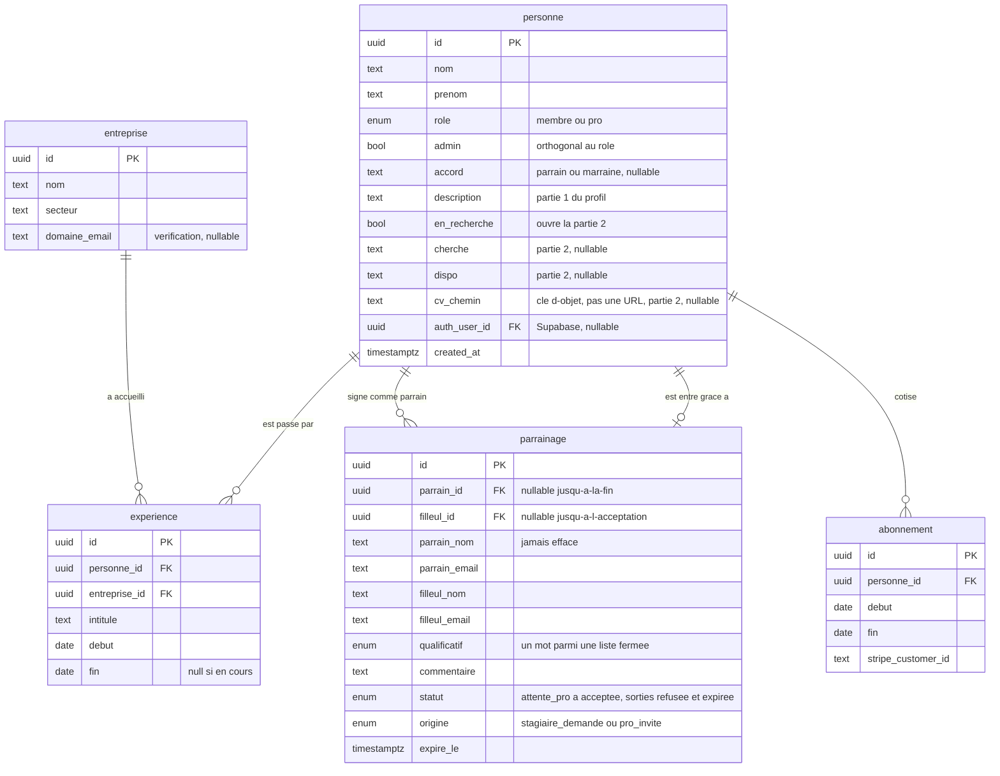
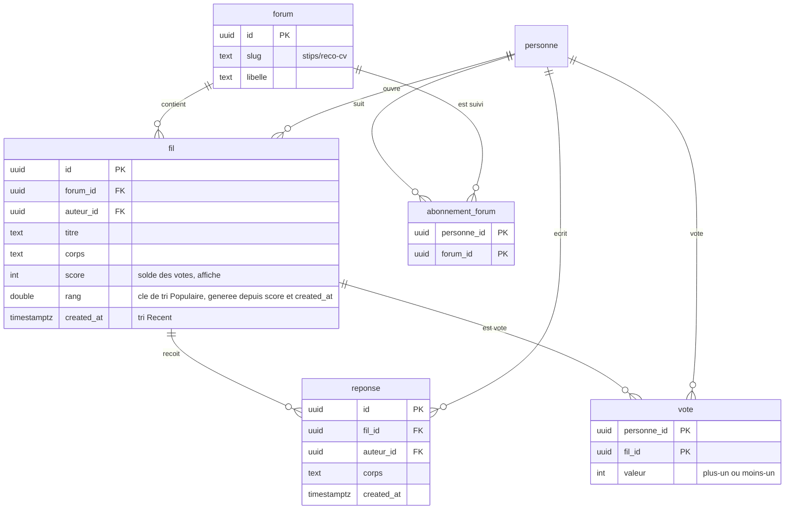
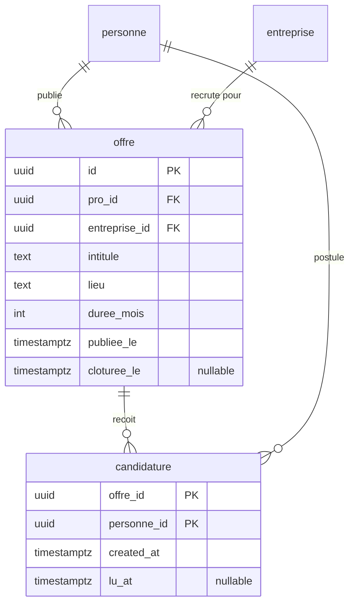
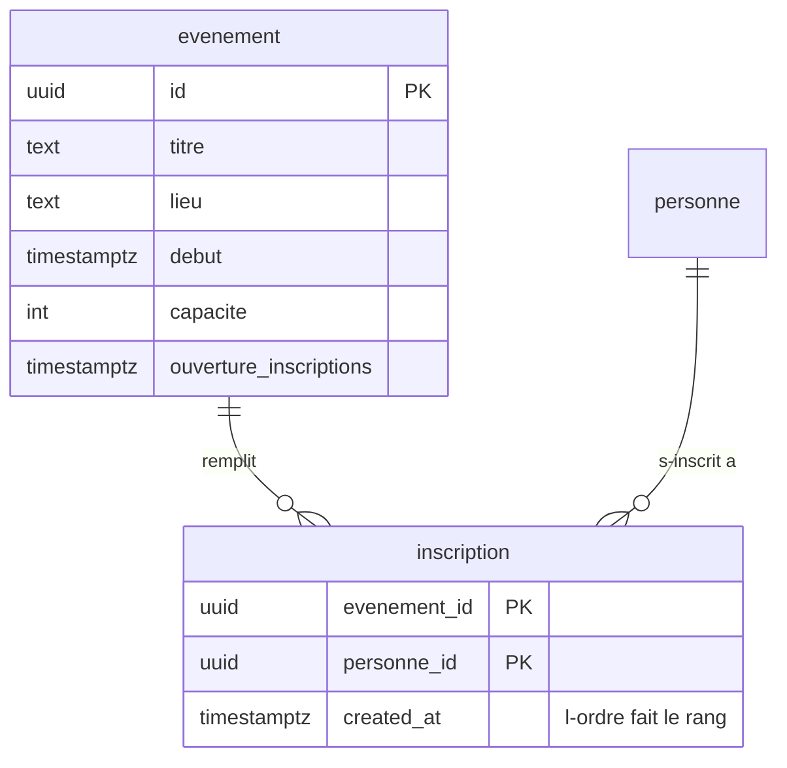
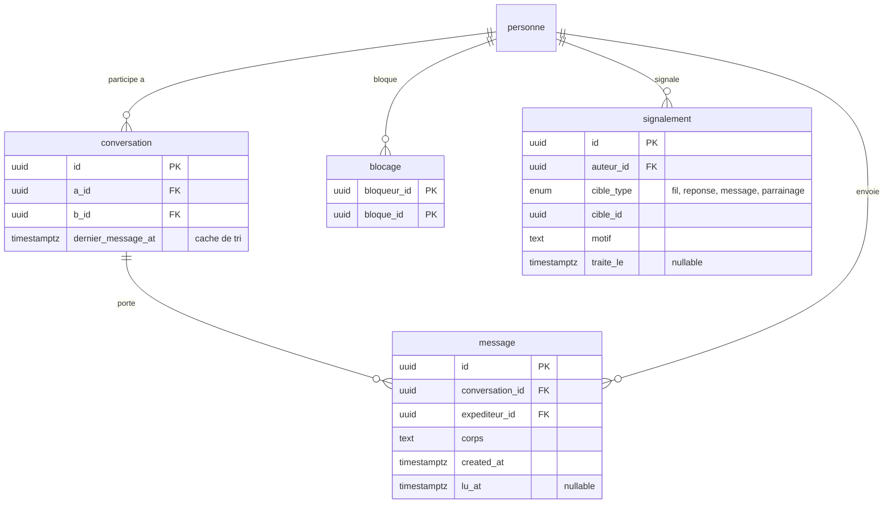

# Le schéma de Stips, en images

Le *pourquoi* de chaque choix est dans [`README.md`](./README.md) ; ce fichier est la carte.
Dix-huit tables, découpées en cinq domaines parce qu'un seul diagramme de dix-huit tables ne
se lit pas.

`personne` porte ses colonnes une seule fois, dans le premier diagramme. Elle réapparaît
ensuite sans son bloc d'attributs — c'est le même hub partout.

---

## 1. Identité, parrainage, cotisation

Le cœur. `parrainage` est l'objet qui fait exister un membre, et c'est la seule table qui
mélange clés étrangères et identités en texte : aux premières étapes du flux, ni le filleul ni
parfois le parrain n'ont de compte.



**Ce qui n'est pas là, et c'est voulu** : pas de colonne `sexe` (seul l'accord grammatical
servait), pas de table `carte` (la carte flip est une route, pas une entité), pas de colonne
`reponse_filleul` (le recours est un signalement).

---

## 2. Forum

Un vote est une **ligne**, pas un compteur : c'est la clé primaire `(personne_id, fil_id)` qui
interdit le double vote. `fil.score` est un cache de tri au-dessus de ces lignes, recalculable
par un `SUM(valeur)` — pas un `COUNT(*)`, qui compterait un vote négatif comme +1.

`score` est ce qu'on **affiche** ; `rang` est ce sur quoi on **trie**. Le second applique une
décroissance temporelle façon Reddit : rien ne décroît réellement, c'est le terme temporel qui
*monte* pour les fils récents, si bien que `rang` ne dépend que de deux valeurs de sa propre
ligne et **ne change qu'au moment d'un vote**. Aucune tâche planifiée à faire tourner.



---

## 3. Recrutement

Une offre appartient à un pro **et** à une entreprise : le pro peut changer d'employeur, ses
anciennes offres ne suivent pas.



⚠️ `entreprise_id`, `lieu`, `duree_mois` et `cloturee_le` n'existent pas dans les données
factices d'aujourd'hui : `Offre` n'a qu'une chaîne `meta` et pas d'employeur du tout. Ça ne se
voyait pas tant que seul le pro regardait ses propres offres — l'écran Stages du membre l'a
révélé.

---

## 4. Événements

**Aucun compteur d'inscrits, et aucun verrou sur les places.** On insère tout le monde ; les
`capacite` premiers par `created_at` sont inscrits, les suivants sont en liste d'attente. Pas
de vérification-puis-insertion, donc pas de survente, et une annulation promeut le suivant
sans qu'on fasse rien.



---

## 5. Messagerie et modération

Tout le monde peut écrire à tout le monde, donc aucune table d'autorisation — et `blocage`
devient le seul frein du système. `conversation` existe pour rendre la liste des conversations
indexable sans normaliser la paire avec `LEAST`/`GREATEST` dans une sous-requête.



`signalement.cible_type = 'parrainage'` est le recours d'un membre sur sa propre reco. C'est
tout le dispositif de rectification : zéro table, zéro colonne en plus.

---

## Le journal des décisions

| Décision | Raison courte |
|---|---|
| Une table `personne`, pas `Member` + `Sponsor` | mêmes colonnes, et un membre devient pro ; deux tables imposeraient des clés étrangères nullables XOR partout |
| Deux rôles, `membre` et `pro` ; « parrain » déduit | être parrain est un rôle dans une relation, pas un type de compte |
| `admin` en booléen séparé | Papa est aussi un membre ou un pro ; un troisième rôle ne composerait pas |
| Pas de colonne `sexe` | le seul usage réel était l'accord grammatical — on stocke le terme voulu |
| Pas de table `carte` | la carte flip est une projection de trois tables : une route, pas une entité |
| Un `qualificatif`, pas une note | un mot décrit sans classer ; une note ordonne les gens et rend un 4,3 éliminatoire face à un 4,6 |
| Des noms (`Rigueur`), pas des adjectifs (`Rigoureux`) | un nom s'écrit pareil pour tout le monde ; un adjectif obligerait à dériver la forme de `personne.accord` à chaque affichage |
| La carte montre le parrainage le plus récent | un membre en accumule un par stage, et il n'existe pas de moyenne de mots — la carte affiche déjà un seul parrain et un seul commentaire |
| Aucun compteur stocké… | `inscrits`, `votes`, `heures`, `duree`, `membresTotal` dérivent de lignes ou de dates |
| …sauf trois clés de tri | `fil.score`, `fil.rang` et `conversation.dernier_message_at` : un `SUM()`/`MAX()` en sous-requête ne s'indexe pas |
| « Populaire » trie sur `rang`, pas sur `score` | un solde brut fige les mêmes fils en tête pour toujours ; τ = 14 jours, la seule molette, volontairement longue tant que le trafic est faible |
| Le classement monte au lieu de décroître | c'est ce qui rend `rang` calculable depuis sa propre ligne — une gravité façon Hacker News changerait le classement sans vote, donc exigerait un recalcul périodique |
| Un vote = une ligne | la clé primaire composite interdit le double vote, et permet de le retirer |
| Places par ordre d'arrivée | supprime la course sur la capacité au lieu de la verrouiller |
| Une table `forum`, pas une énumération | à 10 000 membres la liste bougera, et une valeur d'énum est une migration |
| `conversation` en plus de `message` | rend la liste des conversations indexable sans astuce `LEAST`/`GREATEST` |
| `blocage` et `signalement` | règle 1.2 d'Apple sur le contenu généré : condition de mise en ligne, pas prévision |
| Tout le monde peut écrire à tout le monde | tranché produit — le blocage et une limite de débit deviennent le seul frein |
| Un seul `parrainage`, deux `origine` | les deux chemins d'entrée produisent le même objet |
| Pas de validation si le pro a un compte | il est déjà vérifié ; la charge passe à un plafond d'invitations |
| `parrain_nom` jamais effacé | un membre doit pouvoir dire qui l'a parrainé même si ce pro n'a pas de compte |
| Recours sur une reco = signalement | « la reco est forcément bonne » ne couvre ni l'art. 16 ni l'art. 14 ; le signalement les couvre pour zéro colonne |
| `cv_chemin`, pas `cv_url` | une URL signée expire, une URL publique ouvre le bucket à tout le monde — la colonne garde un chemin, l'API signe à la lecture |
| Des UUID, pas des entiers | des identifiants énumérables laissent parcourir l'annuaire d'un club privé |
| Notre API devant Postgres | le contrat additif et `/v1` supposent une couche qu'on contrôle ; en mode client-direct le schéma *est* l'API publique |

---

## Faire une plus belle version de ce schéma

Les diagrammes ci-dessus sont en Mermaid : ils vivent dans le repo, se versionnent avec le
schéma, se rendent dans GitHub et dans VS Code, et ne coûtent rien. C'est le bon choix pour la
**source de vérité**. Pour une version présentable — pitch, dossier, mur du bureau :

| Outil | Ce qu'il vaut ici |
|---|---|
| **[dbdiagram.io](https://dbdiagram.io)** | le meilleur rapport effort/résultat. On écrit du DBML (proche de ce fichier), on exporte en PNG ou PDF propre. Gratuit pour un schéma. **À prendre en premier.** |
| **[Azimutt](https://azimutt.app)** | open source, se branche sur un vrai Postgres et l'explore. Utile *après* les migrations Drizzle, quand la base existe : il montre le schéma réel, pas celui qu'on croit avoir. |
| **[DrawSQL](https://drawsql.app)** | plus joli par défaut que dbdiagram, collaboratif, freemium. Bien si le diagramme doit être montré à des non-techniques. |
| **[Excalidraw](https://excalidraw.com)** | pour expliquer *un* mécanisme à la main — le flux de parrainage, la liste d'attente. Pas pour les dix-huit tables. |
| Figma / Illustrator | seulement si le schéma part dans un document de marque. Aucun lien avec la base, donc faux dès la première migration. |

Le piège à éviter est le même partout : un diagramme dessiné à la main devient faux à la
première migration et personne ne s'en aperçoit. Ce fichier-ci se corrige dans la même *pull
request* que le schéma — c'est tout son intérêt.

---

## Traduction DBML pour dbdiagram.io

Traduction directe des cinq diagrammes Mermaid ci-dessus, colonne pour colonne. À coller tel
quel dans un nouveau projet dbdiagram.io. Ce n'est pas une source de vérité : à refaire à la
main quand une version présentable est nécessaire, pas à resynchroniser à chaque migration.

```dbml
Project stips {
  database_type: 'PostgreSQL'
}

// 1. Identite, parrainage, cotisation
Table personne {
  id uuid [pk, note: 'identifiant unique']
  nom text [note: 'nom de famille']
  prenom text [note: 'prenom']
  role enum [note: 'membre ou pro']
  admin bool [note: 'acces admin, independant du role']
  accord text [note: 'terme grammatical choisi par la personne (parrain ou marraine), remplace une colonne sexe, nullable']
  description text [note: 'presentation libre, partie 1 du profil']
  en_recherche bool [note: 'bool qui ouvre la partie 2 du profil (recherche de stage ou poste)']
  cherche text [note: 'ce que la personne recherche, partie 2, nullable']
  dispo text [note: 'disponibilite declaree, partie 2, nullable']
  cv_chemin text [note: 'chemin de l-objet dans le bucket prive (cv/personne_id/uuid.pdf), l-URL signee se mint a la lecture, partie 2, nullable']
  auth_user_id uuid [note: 'lien vers le compte Supabase Auth, nullable tant que la personne n-a pas de compte']
  created_at timestamptz [note: 'date de creation du profil']
}

Table entreprise {
  id uuid [pk, note: 'identifiant unique']
  nom text [note: 'raison sociale']
  secteur text [note: 'secteur d-activite']
  domaine_email text [note: 'domaine utilise pour verifier l-appartenance d-un pro, nullable']
}

Table experience {
  id uuid [pk, note: 'identifiant unique']
  personne_id uuid [note: 'qui a fait le stage ou le poste']
  entreprise_id uuid [note: 'dans quelle entreprise']
  intitule text [note: 'intitule du poste ou du stage']
  debut date [note: 'date de debut']
  fin date [note: 'date de fin, null si en cours']
}

Table parrainage {
  id uuid [pk, note: 'identifiant unique']
  parrain_id uuid [note: 'FK personne, nullable tant que le parrain n-a pas de compte']
  filleul_id uuid [note: 'FK personne, nullable tant que le filleul n-est pas accepte']
  parrain_nom text [note: 'identite du parrain en texte, jamais effacee meme sans compte']
  parrain_email text [note: 'email du parrain en texte']
  filleul_nom text [note: 'identite du filleul en texte']
  filleul_email text [note: 'email du filleul en texte']
  qualificatif enum [note: 'le mot choisi par le parrain dans une liste fermee: autonomie, rigueur, curiosite, fiabilite, methode, tenacite, creativite, initiative']
  commentaire text [note: 'commentaire libre accompagnant le qualificatif']
  statut enum [note: 'attente_pro, attente_validation, attente_acceptation, acceptee, plus deux sorties possibles a toute etape: refusee et expiree']
  origine enum [note: 'comment le parrainage a demarre: stagiaire_demande ou pro_invite']
  expire_le timestamptz [note: 'date limite avant expiration du parrainage en attente']
}

Table abonnement {
  id uuid [pk, note: 'identifiant unique']
  personne_id uuid [note: 'qui cotise']
  debut date [note: 'debut de la periode couverte']
  fin date [note: 'fin de la periode couverte']
  stripe_customer_id text [note: 'client Stripe correspondant, 100 euros par an']
}

Ref: experience.personne_id > personne.id // est passe par
Ref: experience.entreprise_id > entreprise.id // a accueilli
Ref: parrainage.parrain_id > personne.id // signe comme parrain
Ref: parrainage.filleul_id - personne.id // est entre grace a
Ref: abonnement.personne_id > personne.id // cotise

// 2. Forum
Table forum {
  id uuid [pk, note: 'identifiant unique']
  slug text [note: 'identifiant lisible utilise dans les URLs, ex stips/reco-cv']
  libelle text [note: 'nom affiche']
}

Table fil {
  id uuid [pk, note: 'identifiant unique']
  forum_id uuid [note: 'forum d-appartenance']
  auteur_id uuid [note: 'qui a ouvert le fil']
  titre text [note: 'titre du fil']
  corps text [note: 'contenu du message d-ouverture']
  score int [note: 'cache du solde de votes (SUM valeur), la valeur affichee']
  rang double [note: 'cle de tri Populaire: sign(score)*log10(max(abs(score),1)) + epoch(created_at AT TIME ZONE UTC)/1209600 ou 1209600s = 14 jours, colonne generee STORED, ne change qu-au vote']
  created_at timestamptz [note: 'tri Recent']
}

Table reponse {
  id uuid [pk, note: 'identifiant unique']
  fil_id uuid [note: 'fil auquel la reponse appartient']
  auteur_id uuid [note: 'qui a repondu']
  corps text [note: 'contenu de la reponse']
  created_at timestamptz [note: 'date de la reponse']
}

Table vote {
  personne_id uuid [pk, note: 'cle composite avec fil_id, empeche un double vote']
  fil_id uuid [pk, note: 'fil vote']
  valeur int [note: 'plus-un ou moins-un']
}

Table abonnement_forum {
  personne_id uuid [pk, note: 'qui suit']
  forum_id uuid [pk, note: 'quel forum, pour les notifications de nouveaux fils']
}

Ref: fil.forum_id > forum.id // contient
Ref: fil.auteur_id > personne.id // ouvre
Ref: reponse.fil_id > fil.id // recoit
Ref: reponse.auteur_id > personne.id // ecrit
Ref: vote.fil_id > fil.id // est vote
Ref: vote.personne_id > personne.id // vote
Ref: abonnement_forum.personne_id > personne.id // suit
Ref: abonnement_forum.forum_id > forum.id // est suivi

// 3. Recrutement
// entreprise_id, lieu, duree_mois et cloturee_le n'existent pas dans les donnees
// factices d'aujourd'hui, voir la note dans le diagramme Mermaid ci-dessus.
Table offre {
  id uuid [pk, note: 'identifiant unique']
  pro_id uuid [note: 'qui a publie l-offre']
  entreprise_id uuid [note: 'pour quelle entreprise, peut differer de l-employeur actuel du pro']
  intitule text [note: 'intitule du poste']
  lieu text [note: 'lieu du poste']
  duree_mois int [note: 'duree en mois']
  publiee_le timestamptz [note: 'date de publication']
  cloturee_le timestamptz [note: 'nullable, date de cloture']
}

Table candidature {
  offre_id uuid [pk, note: 'cle composite avec personne_id, empeche de postuler deux fois']
  personne_id uuid [pk, note: 'qui postule']
  created_at timestamptz [note: 'date de candidature']
  lu_at timestamptz [note: 'nullable, date de lecture par le recruteur']
}

Ref: offre.pro_id > personne.id // publie
Ref: offre.entreprise_id > entreprise.id // recrute pour
Ref: candidature.offre_id > offre.id // recoit
Ref: candidature.personne_id > personne.id // postule

// 4. Evenements
Table evenement {
  id uuid [pk, note: 'identifiant unique']
  titre text [note: 'titre de l-evenement']
  lieu text [note: 'lieu']
  debut timestamptz [note: 'date et heure de debut']
  capacite int [note: 'nombre de places']
  ouverture_inscriptions timestamptz [note: 'date a partir de laquelle on peut s-inscrire']
}

Table inscription {
  evenement_id uuid [pk, note: 'cle composite avec personne_id, empeche une double inscription']
  personne_id uuid [pk, note: 'qui s-inscrit']
  created_at timestamptz [note: 'l-ordre fait le rang: les capacite premiers sont inscrits, les suivants en liste d-attente']
}

Ref: inscription.evenement_id > evenement.id // remplit
Ref: inscription.personne_id > personne.id // s-inscrit a

// 5. Messagerie et moderation
Table conversation {
  id uuid [pk, note: 'identifiant unique']
  a_id uuid [note: 'une des deux personnes de la conversation']
  b_id uuid [note: 'l-autre personne de la conversation']
  dernier_message_at timestamptz [note: 'cache de tri, date du dernier message']
}

Table message {
  id uuid [pk, note: 'identifiant unique']
  conversation_id uuid [note: 'conversation d-appartenance']
  expediteur_id uuid [note: 'qui a envoye']
  corps text [note: 'contenu du message']
  created_at timestamptz [note: 'date d-envoi']
  lu_at timestamptz [note: 'nullable, date de lecture par le destinataire']
}

Table blocage {
  bloqueur_id uuid [pk, note: 'cle composite avec bloque_id, qui bloque']
  bloque_id uuid [pk, note: 'qui est bloque, ne peut plus envoyer de message']
}

Table signalement {
  id uuid [pk, note: 'identifiant unique']
  auteur_id uuid [note: 'qui signale']
  cible_type enum [note: 'type de l-objet signale: fil, reponse, message, parrainage']
  cible_id uuid [note: 'id de l-objet vise, polymorphe donc pas de FK stricte']
  motif text [note: 'texte libre expliquant le signalement']
  traite_le timestamptz [note: 'nullable, date de traitement par la moderation']
}

Ref: message.conversation_id > conversation.id // porte
Ref: conversation.a_id > personne.id // participe a
Ref: conversation.b_id > personne.id // participe a
Ref: message.expediteur_id > personne.id // envoie
Ref: blocage.bloqueur_id > personne.id // bloque
Ref: blocage.bloque_id > personne.id // est bloque
Ref: signalement.auteur_id > personne.id // signale
```
